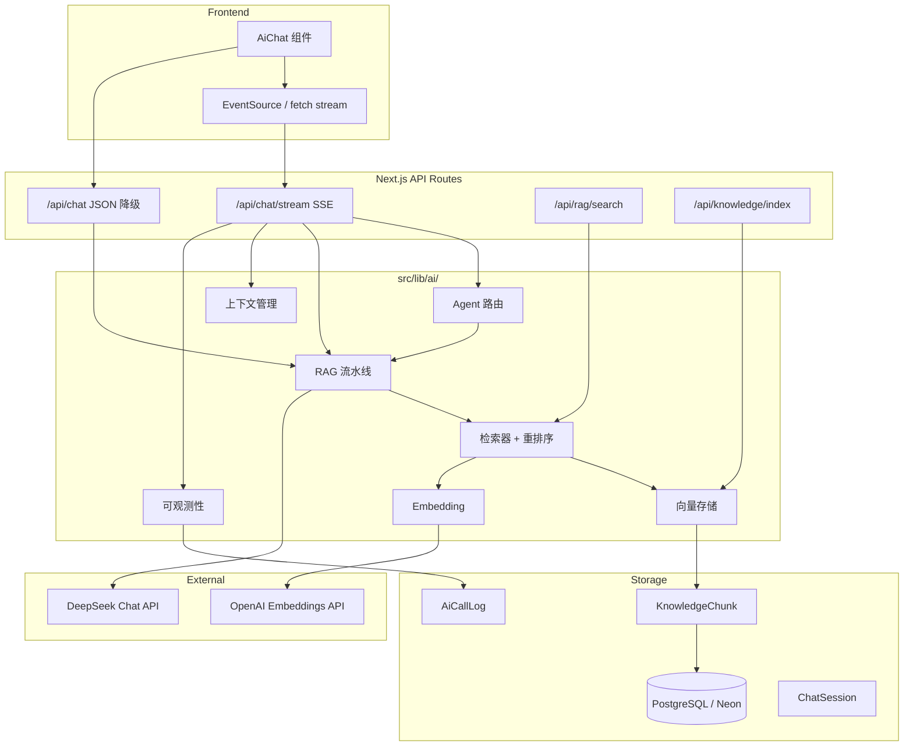

# AI 服务架构 — RAG + Agent + SSE

## 概览

AI 后端是位于 `src/lib/ai/` 下的模块化服务层，集成在 Next.js 单体应用中。它提供检索增强生成（RAG）、流式聊天、多 Agent 路由和可观测性——架构设计为后续可抽离为独立微服务。

## 架构图



## 数据流 — RAG 聊天（P0）

```
用户提问
    │
    ▼
意图分类（Agent Router）
    │
    ▼
Query Embedding（OpenAI text-embedding-3-small）
    │
    ▼
向量检索（余弦相似度 + 关键词重排序）
    │
    ▼
上下文组装（Top-K chunks → prompt）
    │
    ▼
DeepSeek 聊天补全（stream=true）
    │
    ▼
SSE token → 前端打字机渲染
```

## Agent 设计（P1）

| Agent | 触发条件 | 检索侧重 |
|-------|---------|---------|
| vocabulary | 「什么意思」、翻译、拼音相关问题 | 词汇、例句 |
| grammar | 中文句子、「语法」、「纠错」 | 语法、例句、课程 |
| practice | 「练习」、「对话」、角色扮演 | 课程、例句 |
| report | 「学习报告」、「my progress」 | 用户学习进度上下文 |
| general | 默认情侣闲聊 | 全部来源 |

路由使用轻量级正则匹配（不依赖 LangChain）。需要时可升级为基于 LLM 的路由。

## 模块参考

| 模块 | 文件 | 职责 |
|------|------|------|
| Embeddings | `embeddings.ts` | OpenAI API + 开发环境 hash 降级 |
| Vector Store | `vector-store.ts` | KnowledgeChunk 的 CRUD + 相似度检索 |
| Retriever | `retriever.ts` | Top-K 检索 + 关键词重排序 |
| RAG Pipeline | `rag-pipeline.ts` | 上下文构建、流式输出、摘要压缩 |
| Agent Router | `agents/router.ts` | 意图分类 + Agent 配置 |
| Observability | `observability.ts` | AiCallLog、ChatSession 持久化 |

## 数据库模型

- **KnowledgeChunk** — 已嵌入的知识条目（word/grammar/example/lesson）
- **ChatSession** — 对话会话，可选摘要
- **ChatMessage** — 持久化消息，含 RAG 元数据
- **AiCallLog** — 每次 AI 调用的 prompt、response、延迟

## 性能目标

| 指标 | 目标 | 验证方式 |
|------|------|---------|
| RAG 检索 | p50 < 200ms | `npm run ai:bench` |
| SSE 首 token | < 500ms | 浏览器 DevTools / bench 脚本 |
| 10 路 SSE 并发 | 0 错误 | `BENCH_CONCURRENCY=10 npm run ai:bench` |
| RAG 命中率 | 90%+ 回答引用知识库 | 人工审查 + metadata 日志 |

## 增量索引

管理员通过 `/admin/vocabulary` 添加词汇后，调用：

```bash
POST /api/knowledge/index
{ "action": "reindex-word", "sourceId": "<word-id>" }
```

全量重建索引：

```bash
npm run ai:index
```

## 环境变量

| 变量 | 必填 | 说明 |
|------|------|------|
| `DEEPSEEK_API_KEY` | 是 | 聊天生成 |
| `OPENAI_API_KEY` | 推荐 | Embedding（无则降级为 hash） |
| `EMBEDDING_MODEL` | 否 | 默认 `text-embedding-3-small` |
| `RAG_TOP_K` | 否 | 初始检索数量（默认 8） |
| `RAG_RERANK_TOP_K` | 否 | 重排序后保留数（默认 4） |
| `MAX_CONTEXT_TOKENS` | 否 | 触发摘要压缩的 token 阈值 |
| `MAX_HISTORY_MESSAGES` | 否 | 历史消息窗口大小 |

## 后续：pgvector / ChromaDB

生产环境使用 **Neon 上的 pgvector** 及 HNSW 索引。索引完成后执行一次：

```bash
npm run pgvector:setup
```

向量存储通过 `SiteSetting.pgvector_enabled` 自动检测 pgvector；不可用时降级为内存余弦相似度计算。

## 成本控制

- Embedding 缓存在 `KnowledgeChunk.embedding` 中 — 仅在 upsert 时重新计算
- 仅当历史消息超过 token 阈值时才触发上下文摘要压缩
- 聊天补全 `max_tokens: 500`
- 非必要路径（如 report agent）可在后续优化中跳过 RAG 检索
